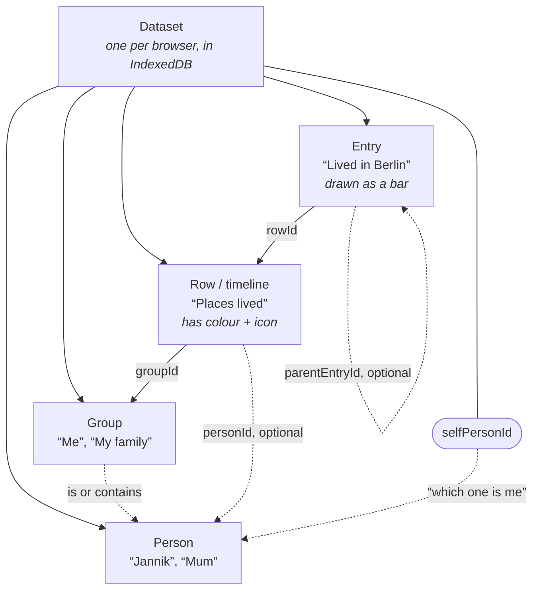
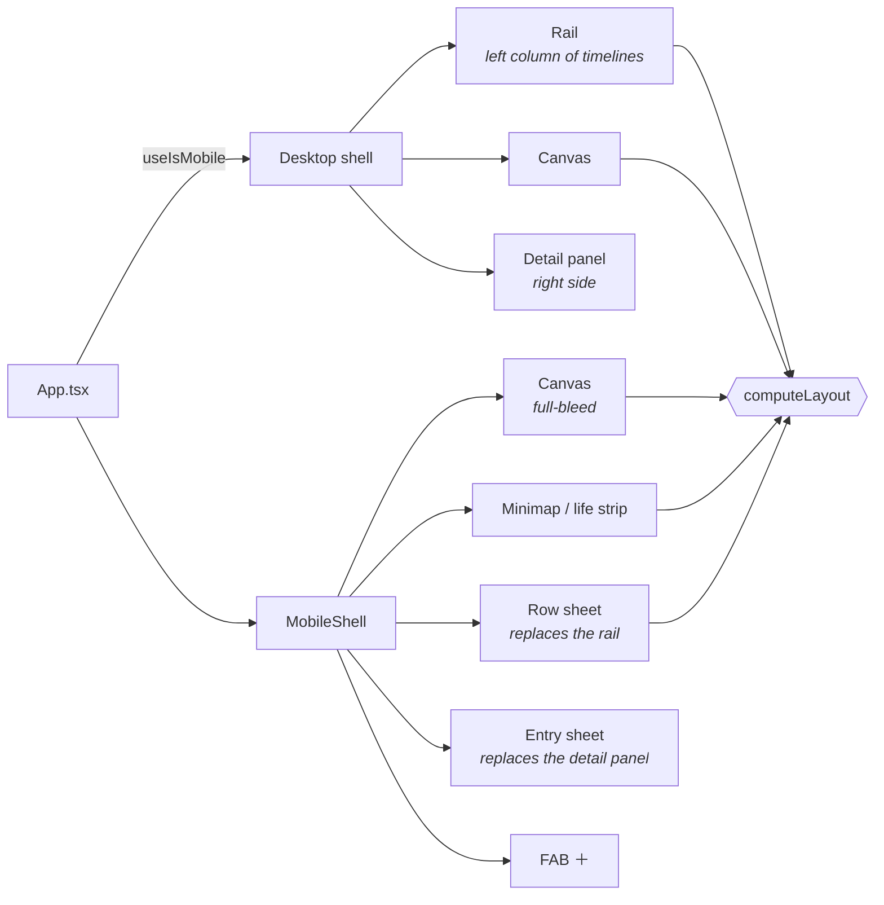

# Chronicle glossary

The words we use in code, in plans, and in review — so we can point at the same
thing without describing it. Each entry says what it is, then **where it lives**.

---

## The shape of everything



Read it as sentences: **an entry sits on a row, a row sits in a group, a group
either is or contains people.** Everything else is optional.

---

## The data (what you own)

**Dataset** — everything you have, as one object: people, groups, rows, entries.
There is exactly one, stored under the key `main` in IndexedDB. Exporting is
literally this object as JSON.
→ `src/model/types.ts` (`TimelineDataset`), `src/storage/db.ts`

**Entry** — one thing that happened, over a span of time. "Worked at Acme",
"Lived in Berlin", "Read Dune". Drawn as a **bar**. This is the atom of the app.
→ `types.ts` (`TimelineEntry`)

**Row** *(also: **timeline**)* — one horizontal lane holding entries. "Places
lived" is a row; each flat you lived in is an entry on it. In the UI we say
*timeline*; in code it is `TimelineRow` / `rowId`, because "timeline" was already
taken by the app itself. Rows carry their own **colour** and **icon**.
Rows are **concurrent**: entries on one row may freely overlap, and no check
prevents it.
→ `types.ts` (`TimelineRow`), `src/render/layout.ts`

**Group** — a labelled bundle of rows, drawn as a section header. "Me", "My
family", "World events". A group either *is* a person or *contains* people —
never both (a deliberate v1 cut, no nesting).
→ `types.ts` (`Group`)

**Person** — a human the rows can belong to. Your own person is the **self
person** (`dataset.selfPersonId`), set during setup; it is how the app knows
whose birth year to show and where new timelines go.
→ `types.ts` (`Person`)

**Category** — **gone.** Removed from the model; colour and icon moved onto the
row. If you see "category" today it means only the *wording group* the add-entry
assistant uses to phrase its questions — nothing is stored on the entry.
→ `src/onboarding/addEntryCategories.ts`

**Public data** — read-only timelines shipped with the app (world events, famous
people), loaded from `public-data/*.json` at build time. Every id is prefixed
`pub:<file>:` so it can never collide with, or be written over, your own data.
→ `src/publicData/`

**Schema version** — a number stored in the dataset so an old export can be
recognised and either upgraded or honestly rejected. Never a silent migration.
→ `types.ts` (`SCHEMA_VERSION`), `src/storage/exportImport.ts`

---

## Time (how vague a date is allowed to be)

**FuzzyDate** — a date that knows how sure it is: an instant in **ms** plus a
**precision**. Every stored ms is **UTC**, always.
→ `src/model/fuzzyDate.ts`

**Precision** — how sharply a date is known: `exact` · `day` · `month` · `year` ·
`circa`. It is not decoration — it decides how blurred the bar's edge is drawn.

**Fuzz days** — the blur, in days, that a precision implies (`month` → 15,
`year` → 182, `circa` → 365). An entry can override it with `fuzzDays` to say
"somewhere in this two-year window".

**Fade-in days / fade-out days** — a *different* kind of soft edge: the thing
genuinely started gradually (a friendship, a habit), rather than the date being
uncertain. Visually the two are combined into one continuous edge, but they mean
different things and are stored separately.

**Ongoing** — an entry with **no end**. Not "ends today" — the end is absent.
Drawn as an open arrow rather than a hard stop. This distinction is the source of
the "still ongoing" vs "now →" confusion in the mobile date editor.

**Ramp / ramp bounds** — the computed geometry of one bar's soft edges: where it
starts to appear, where it is fully solid, where it fades out. One gradient does
all of it (butting a solid rect against a gradient rect shows a seam).
→ `fuzzyDate.ts` (`rampBounds`), `src/render/bars.ts`

### Anatomy of a bar

```
      visualStart   solidStart              solidEnd   visualEnd
           │            │                       │          │
           ▼            ▼                       ▼          ▼
           ░░▒▒▓▓███████████████████████████████▓▓▒▒░░
           └─── ramp ──┘   ← fully opaque →    └── ramp ──┘
              in                                    out

           ← “around 2011” ──→        ←── “ended mid-2019, roughly” ──→
```

The two ramps look identical but can come from two different causes:

```
   PRECISION FUZZ                        FADE IN / FADE OUT
   “I don’t know exactly when”           “it genuinely started gradually”
   month → 15 d   year → 182 d           fadeInDays: 400
   circa → 365 d  (or fuzzDays: 730)     fadeOutDays: 90

               ╲                        ╱
                ╲──── one gradient ────╱
                   (never two rects — the seam shows)
```

An **ongoing** entry has no end at all, and is drawn open:

```
   ░░▒▒▓▓████████████████████████████▶      (not a wall at today’s date)
```

---

## The picture (how it gets drawn)

**Canvas** — the big scrollable drawing of all timelines. Hand-painted; not DOM,
not SVG. *For users we should call it "the timeline" — "canvas" is our word, not
theirs.*
→ `src/render/engine.ts`

**Engine** — the class that owns the canvas: painting, panning, zooming, hit
testing. Framework-agnostic on purpose — no React imports inside it.
→ `src/render/engine.ts`

**Layout** — the computed list of what goes where vertically (group headers,
people, rows, their heights and y positions). The canvas *and* the DOM rail *and*
the minimap all render from this one result, which is what keeps them in sync.
→ `src/render/layout.ts` (`computeLayout`)

**Time scale** — the mapping between an instant and an x pixel, and back
(`msToX` / `xToMs`). Zooming changes `msPerPx`.
→ `src/render/timeScale.ts`

**Axis** — the horizontal date ruler. It always shows **two levels at once**: a
**coarse tick** (the title, e.g. `2015`) and a **fine tick** (the subtitle, e.g.
`Q3`). Neither level is ever allowed to go blank.
→ `src/render/timeAxis.ts`

**Bar** — one entry as drawn: a coloured rectangle with soft edges and a label.

**Short title** — a shorter name for an entry, used on the bar when the full
title does not fit. Exists in the model and on desktop; not yet in the mobile
sheets.
→ `types.ts` (`shortTitle`), `bars.ts` (`pickBarLabel`)

**Hit test** — working out which entry a tap landed on. Picks the **narrowest**
overlapping bar, because rows are concurrent and a short bar often sits inside a
long one.
→ `engine.ts` (`entryHits`)

---

## The interface

### Two shells, one dataset



`computeLayout()` is the single source both the drawing and the lists read from —
that shared result is what keeps them from drifting apart.

### The mobile screen

```
┌──────────────────────────────────────┐
│  🔍 Search                       ⋯   │ ← chips (🔍 grows into the field)
│ ┌──────────────────────────────────┐ │
│ │▬▬▬  ▬▬▬▬▬▬▬  ▬▬    ▬▬▬▬▬   ▬▬▬▬ │ │ ← minimap (life strip)
│ │ ▬▬▬▬▬▬▬▬  ▬▬▬     ┏━━━━━┓       │ │   one lane per timeline
│ │   ▬▬  ▬▬▬▬▬▬▬▬▬▬  ┃▬▬▬▬▬┃  ▬▬▬  │ │   ┏━┓ = viewport window:
│ │ ▬▬▬▬  ▬▬▬▬▬▬      ┗━━━━━┛▬▬  ▬▬ │ │   ┗━┛ narrower AND shorter
│ │   ▬▬▬▬▬  ▬▬▬▬▬▬▬▬  ▬▬▬▬    ▬▬   │ │       than the whole strip
│ └──────────────────────────────────┘ │        ↑ “top stack”, measured
│  2010      2015      2020      2025  │ ← axis, starts below the stack
│ ─────────────────────────────────────│
│    ░▓██████████▓░                    │
│         ░▓████████████████▶          │ ← canvas: pan, pinch, tap a bar
│  ░▓████▓░      ░▓██████▓░            │
│                                  ⊕   │ ← FAB, rides the sheet’s edge
│ ╭──────────────────────────────────╮ │
│ │             ───                  │ │ ← grab handle
│ │  Timelines                   ⋯   │ │ ← sheet header (visible at peek)
│ │  3 groups · 12 timelines         │ │
│ ╰──────────────────────────────────╯ │
└──────────────────────────────────────┘
```

### Sheet anchors

A sheet rests at one of three heights and snaps to the nearest when you let go —
weighted by flick speed, so a fast flick skips past the middle one.

```
   FULL ─────╮  ┌────────────────┐   84% of the screen
             │  │ ▨▨▨▨▨▨▨▨▨▨▨▨▨▨ │   reading and editing
             │  │ ▨▨▨▨▨▨▨▨▨▨▨▨▨▨ │
   HALF ─────┤  ├────────────────┤   ~45%
             │  │ ▨▨▨▨▨▨▨▨▨▨▨▨▨▨ │   browsing, canvas still visible
             │  │                │
   PEEK ─────┤  ├────────────────┤   96 px — just the header
             │  │                │   “your timelines live here”
   CLOSED ───╯  └────────────────┘   thrown away; a chip brings it back
```

Dragging the sheet's *content* only moves the sheet if the list is already
scrolled to its top — otherwise you are scrolling the list. That distinction is
what keeps every button inside a sheet tappable.

**Shell** — the whole app frame. There are **two**: the desktop shell and
`MobileShell`. `App.tsx` branches once between them. They are not one layout with
media queries — the information architecture genuinely differs.
→ `src/ui/App.tsx`, `src/ui/MobileShell.tsx`

**Rail** — *desktop only.* The fixed left column listing every timeline, scrolled
in lockstep with the canvas. Mobile has no rail; the sheet's list pane replaces
it.
→ `src/ui/RowRail.tsx`

**Detail panel** — *desktop only.* The side panel for the selected entry. Its
mobile counterpart is the sheet's entry pane.
→ `src/ui/DetailPanel.tsx`

**Bottom sheet** *(or just **sheet**)* — a panel that slides up from the bottom
edge and can be dragged between heights. The mobile app's main surface.
→ `src/ui/BottomSheet.tsx`

**Anchor** — one of the heights a sheet rests at: **peek** (just the header),
**half**, **full**. Dragging between them snaps to the nearest, weighted by how
fast you flicked.
→ `src/ui/sheetSnap.ts`

**Timeline sheet** — *the* sheet on mobile. There is only one, and it holds three
**panes** you navigate between without the sheet itself moving.
→ `src/ui/TimelineSheet.tsx`

**Pane** — one screen inside the sheet. Three of them, sliding sideways like a
phone's navigation stack:

```
   list  ───▶  row  ───▶  entry
     ◀───────    ◀────────
  all your     one          one
  timelines    timeline     entry
```

→ `TimelineListPane.tsx` (the rail's replacement), `RowPane.tsx`,
`EntryPane.tsx`

The stack is **derived, not remembered**: an entry being selected *means* the
entry pane. That is why tapping a bar on the canvas, tapping a row in the list,
and finding something in search all land in the same place. And "back" from an
entry goes to its timeline — a *place*, not a history — because you may have
arrived from the canvas without ever visiting that timeline.

**Minimap** *(also: **life strip**)* — the thin band at the top summarising the
whole dataset: one lane per timeline, with an orange **viewport window** showing
which part the canvas is currently looking at. Tap or drag it to jump — in both
directions.
→ `src/ui/MiniMap.tsx`, `src/render/miniMap.ts`

**Viewport window** — the box drawn on the minimap marking what the canvas can
see: across, a slice of time; down, a slice of your timelines. It shrinks and
moves on both axes.

**Lane band** — the part of the minimap's height that the lanes occupy (the rest
is the year ticks). The viewport window's vertical position is measured against
this, not against the strip's full height.

**FAB** — *floating action button.* The round `＋` hovering over the bottom-right
of the canvas. The standard mobile term for "the one primary action".

**Chip / pill** — a small rounded button, usually one option among several.
**Pill selector** is our replacement for dropdowns: with fewer than ~7 options a
dropdown hides the choices, so we show them all.
→ `src/ui/PillSelector.tsx`

**Editable line** — text that becomes an input when you tap it, and writes on
every keystroke. There is no Save button anywhere in this app.
→ `src/ui/EditableLine.tsx`

**Date range editor** — the mobile start/end editor: two handles on one lane you
drag, plus typed fields.
→ `src/ui/DateRangeEditor.tsx`

**Still ongoing** — what an entry with **no end date** says in the end field.
Internally there is no end; to you it is simply the value that field holds. You
reach it by editing the field — typing it, or tapping the pill that appears
while editing. There is no toggle, on purpose: a toggle beside a field that also
accepted "now" meant two controls claiming one meaning.

**Assistant** — a guided, one-question-per-screen flow.
- **setup assistant** — name, birth date, places lived. Runs on a fresh dataset.
- **add-entry assistant** — behind the FAB, and behind `＋ Add an entry` at the
  foot of a timeline, where it arrives already knowing the timeline and the year.
- **add-timeline assistant** — behind `＋ New timeline` at the foot of the list.
  Name it, style it, then fill it in.

Assistants create nothing until the last step, which is what makes their Back
button safe. The exception is a **table step**.
→ `src/onboarding/`

**Table step** — a step showing *every* row at once, editable, saving as you
type, with no Back button. Used where remembering the fourth thing routinely
corrects the second (places lived; the entries on a new timeline) — there
editing a row *is* the correction, so there is nothing to navigate back through.
→ `PlacesTable.tsx`, `AddTimelineAssistant.tsx`

**Draft** — a half-made entry created by dragging on the canvas. It lives in
`state.draft` and only joins the dataset once you give it a title. The assistant
does *not* use drafts — it asks everything, then writes once.
→ `src/state/actions.ts`

**Cascade** — the set of things a delete would also take with it (an entry's
children, a row's entries). Always described before it happens; never silent.
→ `src/model/cascade.ts`

**Store** — the hand-rolled state container. Every mutation goes through
`actions.ts`; changes are saved to IndexedDB 250 ms after they stop arriving
(**autosave** — no Save button, again).
→ `src/state/store.ts`, `src/state/actions.ts`

**Merged dataset** — your data plus the enabled public data, combined for
display. Read-only things keep their `pub:` ids so the UI knows not to offer an
edit.
→ `src/state/store.ts` (`mergedDataset`)

---

## Conventions worth knowing by name

**Colour variables** — every colour is a `--color-*` CSS custom property, defined
once and overridden in a dark-mode block. The canvas reads the *same* variables
through `readThemeColors()`. A hardcoded hex anywhere means dark mode silently
breaks there.

**Safe area** — the notch/home-indicator margins on modern phones
(`env(safe-area-inset-*)`). Anything pinned to a screen edge must respect them.

**16 px rule** — any input smaller than 16 px makes iOS Safari zoom the page the
moment it is focused. Every mobile input is at least that size. Never fix this by
disabling zoom.

**dvh** — "dynamic viewport height": the CSS unit that accounts for Safari's
address bar collapsing. `100vh` is wrong on mobile; `100dvh` is right.
