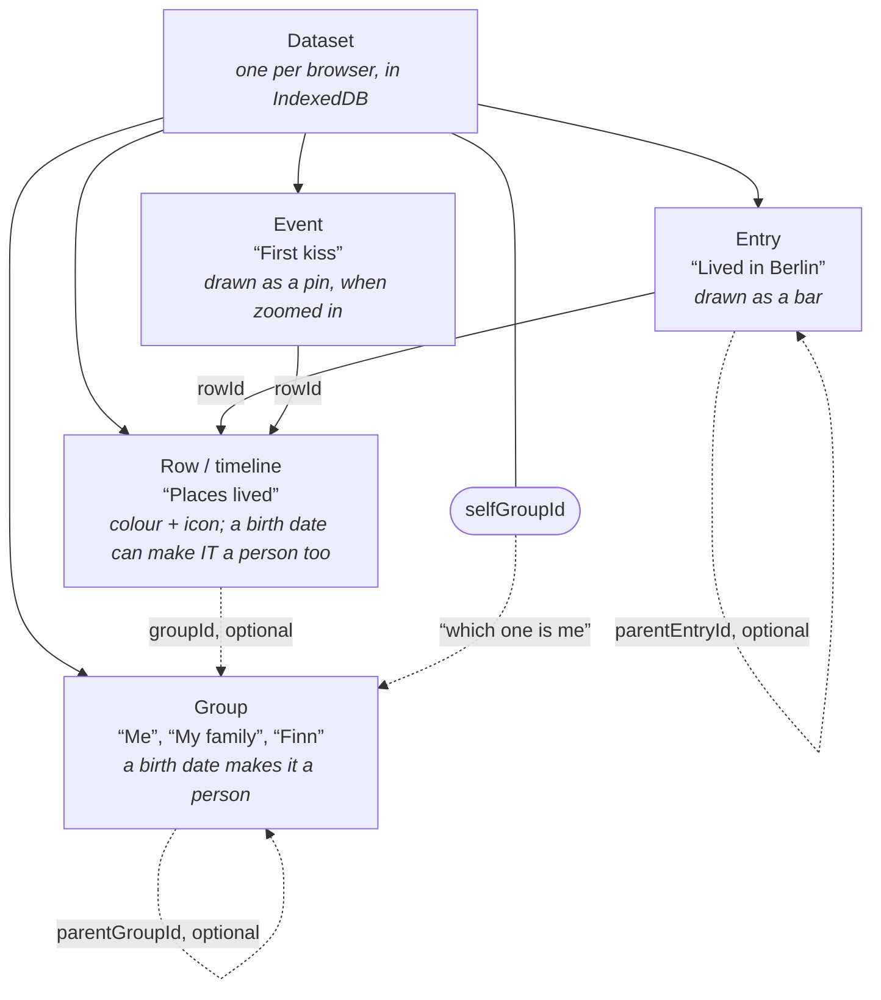
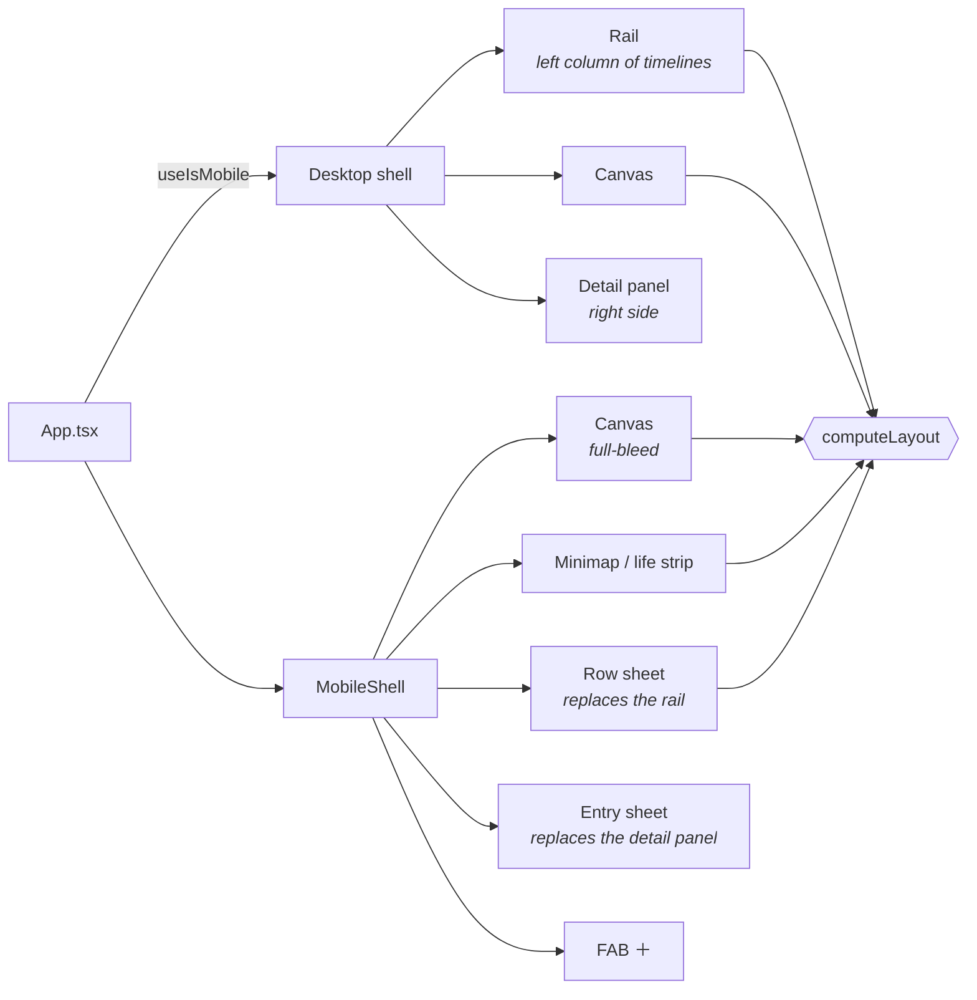

# Chronicle glossary

The words we use in code, in plans, and in review — so we can point at the same
thing without describing it. Each entry says what it is, then **where it lives**.

---

## The shape of everything



Read it as sentences: **an entry sits on a row, an event sits on a row, a row
may sit in a group, and a group may sit in another group — at any depth.**
Everything past "an entry/event sits on a row" is optional.

Four things. There were three until schema v8 added the event, and four before
that — see **Person** below for why that fourth one turned out to be one too
many, and **Event** for why this one is not.

---

## The data (what you own)

**Dataset** — everything you have, as one object: groups, rows, entries, events.
There is exactly one, stored under the key `main` in IndexedDB. Exporting is
literally this object as JSON.
→ `src/model/types.ts` (`TimelineDataset`), `src/storage/db.ts`

**Entry** — one thing that happened, over a span of time. "Worked at Acme",
"Lived in Berlin", "Read Dune". Drawn as a **bar**. This is the atom of the app.
→ `types.ts` (`TimelineEntry`)

**Event** — one thing that happened *at a moment*. "First kiss", "finished the
big project", "she was born". Drawn as a **pin** on its row, and only once the
view is zoomed in far enough for a point in time to be readable — from a whole
life away it would be a speck on a year it cannot resolve. It has one **date**
(a FuzzyDate, so "sometime in 1998" draws a wide precision band rather than a
false pin on 1 July), a title, optionally an emoji, a note and a place — and
nothing that only makes sense for a duration.
→ `types.ts` (`TimelineEvent`), `src/render/events.ts`

**Entry vs. event** — *span* vs. *point*, and that is the whole of it. A
zero-length entry is not an event: a bar with no width has no label anchor, no
soft edges and no honest "ongoing". If you catch yourself giving something a
one-day span, it wanted to be an event.

**Row** *(also: **timeline**)* — one horizontal lane holding entries and events.
"Places lived" is a row; each flat you lived in is an entry on it, and the day
the boiler exploded is an event on it. In the UI we say
*timeline*; in code it is `TimelineRow` / `rowId`, because "timeline" was already
taken by the app itself. Rows carry their own **colour**, **icon**, and — since
v9 — optionally a **birth date** (see **Person** below). A row's `groupId` is
optional: a timeline needs no group at all (a **top-level timeline**). Rows are
**concurrent**: entries on one row may freely overlap, and no check prevents it.
There is no nesting a row inside another row any more (`parentRowId` is gone,
schema v9) — model what used to be a "sub-timeline" as a **sub-group** holding
one row instead.
→ `types.ts` (`TimelineRow`), `src/render/layout.ts`

**Group** — a labelled bundle of sub-groups and rows, drawn as a section
header. "Me", "My family", "World events". A group can hold **sub-groups**
("My family" → "Finn" → "Finn's kid"), nested to any depth (schema v9 lifted
the one-level cap), and, if it has a **birth date**, it *is* a person. Groups
carry their own **colour** and **icon** too, since v9 — a group is now a
near-mirror of a row in every field except what it can contain. Your own group
is the **self group** (`dataset.selfGroupId`), set during setup; it is how the
app knows whose birth year to show and where new timelines go.
→ `types.ts` (`Group`)

**Sub-group** — a group nested in another one. This is what a person inside
"My family" is. Nests to any depth since schema v9. Its *name* is drawn exactly
like every other name in the rail — same size, same weight, no colour, at every
depth and whether collapsed or not. Three things say "group" instead: the ▸/▾,
the indentation of what it contains, and, while expanded, a shaded background
over its whole extent (`LayoutItem.subtreeEndY`) — a nested group's band paints
on top of its ancestors', so overlap (not a colour per depth) is what makes
deeper nesting read as a stronger shade. Headers still shrink slightly with
depth (`groupHeaderHeight` in `src/render/layout.ts`, with a floor), but that
is row spacing, not type: the matching `groupFontSize` is gone.

**Person** — **not a thing in the model.** A person is a `Group` *or, since
schema v9, a `TimelineRow`* with a birth date; that date is what greys out the
time before someone was born and puts an age next to the name. Most people get
a whole group (a family full of sub-groups and timelines); someone you're not
building out a full family tree for — an acquaintance — can just get one
timeline with its own birth date instead. There used to be a separate `Person`
entity that both `Group` and `TimelineRow` pointed at, which forced the rule "a
group either *is* a person or *contains* people, never both" — an asymmetry
every consumer had to special-case, and the source of a timeline keeping a
stale owner after being moved. Folded into `Group` in schema v6, extended to
`TimelineRow` in v9. `birthDateForRow()` in `src/model/dataset.ts` is the one
place "whose life is this row" gets resolved — the row's own date first, else
the nearest ancestor group's.
→ `types.ts` (`Group.birthDate`, `TimelineRow.birthDate`),
`src/storage/exportImport.ts` (`foldPeopleIntoGroups`)

**Category** — **gone.** Removed from the model; colour and icon moved onto the
row. If you see "category" today it means only the *wording group* the add-entry
assistant uses to phrase its questions — nothing is stored on the entry.
→ `src/onboarding/addEntryCategories.ts`

**Break out** — turning one timeline into a group of timelines, **one per
entry**: "Work" with Job A, Job B and Job C becomes a group "Work" holding three
timelines, each carrying its original entry, so each can then be detailed into
projects, locations or phases. Done to one entry instead, it peels just that
entry onto its own timeline and leaves the rest of the row where it was. The
row's presentation (label, colour, icon, birth date) moves up onto the new
group; its events stay put — the row keeps every one of them, because guessing
which span owns a point in time is a guess. Publishing survives untouched: the
new group is private, the new timelines inherit the row's own `shared` flag.
There is no inverse action, because **collapsing** the group is the inverse you
actually want (see below). The ask called this "exploding"; `plans/break-out-feature-design.md` §1
records why the word is *break out* and not *explode*, *expand* or *split*.
→ `src/model/breakOut.ts`, `src/state/actions.ts` (`breakOutRow`, `breakOutEntry`)

**Collapsed** — a group folded shut, which makes it **a timeline**: the same
row height, no section background, no header weight or colour on its name, only
the ▸ saying it is still a group. It does not go blank and it does not flatten
into one band — it draws **one summary bar per direct child** — per child
timeline, and per child sub-group aggregated over its whole subtree — labelled
and coloured as that child. That is what makes collapsing a broken-out group
give back the picture the single timeline had. Children that overlap in time
stack into **lanes**, packed by comparing milliseconds rather than pixels, so
the lanes stay put while you zoom; children that sit back-to-back share a lane.
Lanes are the one thing that makes a collapsed group taller than a row — the
alternative would be hiding a child. A hidden timeline is left out of the
aggregate entirely.
→ `src/render/layout.ts` (`GroupSummaryBar`, `packLanes`), `src/render/engine.ts` (`drawGroupSummary`)

**Public data** — read-only timelines shipped with the app (world events, famous
people), loaded from `public-data/*.json` at build time. Every id is prefixed
`pub:<file>:` so it can never collide with, or be written over, your own data.
→ `src/publicData/`

**Schema version** — a number stored in the dataset so an old export can be
recognised and either upgraded or honestly rejected. Never a silent migration.
The dataset in IndexedDB goes through the same upgrade as an imported file —
it used to be discarded on any mismatch, which made every schema bump a
silent wipe of the one copy of your data.
→ `types.ts` (`SCHEMA_VERSION`), `src/storage/exportImport.ts`

---

## Sharing (who else can see it)

**Shared** *(also: **published**)* — a timeline you have explicitly made visible
to the people you've invited. Publishing it publishes its entries **and its
events**: neither has a flag of its own, both follow their row. New timelines are **private**; publishing is always
a deliberate act. Stored as `shared` on the row — deliberately *not* the
`visibility` field v1–v3 had and v4 removed, so an old export can never be
mistaken for a publish instruction.
→ `types.ts` (`TimelineRow.shared`), `src/model/sharing.ts`

**Share by default** — a group-level override saying that timelines created
*under here* start shared. Inherited by sub-groups. It changes what the **next**
timeline starts as and never reaches back to publish the ones already there.
→ `types.ts` (`Group.shareByDefault`)

**Grant** — one person's read access to one group or one timeline. Lives on the
server only, never in the dataset: an export is a file people pass around, and
other people's identities have no business in it.

**Invite** — a link carrying an unguessable token, which you send however you
like. Chronicle sends no email. Redeeming it turns it into a grant, or into
co-ownership if it was a "can edit" invite.
→ `src/ui/InviteLanding.tsx`

**Mirror** — someone else's shared timelines, as they arrive on your device. A
read-only dataset merged into the view alongside public data, with every id
prefixed `shared:<account>:`. **Never merged into your own dataset** — which is
what keeps them out of your export and makes revoking a delete of one object.
→ `src/sharing/mirror.ts`

**Sync subset** — the set of records eligible to leave your device. The privacy
gate: every push goes through it, and it fails closed.
→ `src/model/sharing.ts` (`syncSubset`)

**HLC** *(hybrid logical clock)* — the timestamp on a synced record. Wall-clock
time plus a counter plus the writer's account id, so two phones with drifting
clocks still agree on which edit came last.
→ `src/sharing/hlc.ts`

**Tombstone** — the record left behind by a delete, so that a delete arriving
before a concurrent older edit isn't undone by it. Kept server-side; readers
just stop seeing the thing.
→ `src/sharing/lww.ts`

---

## Time (how vague a date is allowed to be)

**FuzzyDate** — a date that knows how sure it is: an instant in **ms** plus a
**precision**. Every stored ms is **UTC**, always.
→ `src/model/fuzzyDate.ts`

**Precision** — how sharply a date is known: `exact` · `day` · `month` · `year` ·
`circa`. It is not decoration — it decides how blurred the bar's edge is drawn.
One stored field, but **two questions** to a user: *granularity* (a year, a
month, a day) and *certainty* (exactly, around then, sometime around). The
mobile add flow asks them separately and folds the pair back into this field —
see `src/onboarding/dateAnswer.ts`.

**Fuzz days** — the blur, in days, that a precision implies (`month` → 15,
`year` → 182, `circa` → 365). An entry can override it with `fuzzDays` to say
"somewhere in this two-year window".

**Fade-in days / fade-out days** — a *different* kind of soft edge: the thing
genuinely started gradually (a friendship, a habit), rather than the date being
uncertain. Visually the two are combined into one continuous edge, but they mean
different things and are stored separately.

**Ongoing** — an entry with **no end**. Not "ends today" — the end is absent.
Drawn as an open arrow rather than a hard stop. This distinction is the source of
the "still ongoing" vs "now →" confusion in the mobile date editor.

**Ramp / ramp bounds** — the computed geometry of one bar's soft edges: where it
starts to appear, where it is fully solid, where it fades out. One gradient does
all of it (butting a solid rect against a gradient rect shows a seam).
→ `fuzzyDate.ts` (`rampBounds`), `src/render/bars.ts`

### Anatomy of a bar

```
      visualStart   solidStart              solidEnd   visualEnd
           │            │                       │          │
           ▼            ▼                       ▼          ▼
           ░░▒▒▓▓███████████████████████████████▓▓▒▒░░
           └─── ramp ──┘   ← fully opaque →    └── ramp ──┘
              in                                    out

           ← “around 2011” ──→        ←── “ended mid-2019, roughly” ──→
```

The two ramps look identical but can come from two different causes:

```
   PRECISION FUZZ                        FADE IN / FADE OUT
   “I don’t know exactly when”           “it genuinely started gradually”
   month → 15 d   year → 182 d           fadeInDays: 400
   circa → 365 d  (or fuzzDays: 730)     fadeOutDays: 90

               ╲                        ╱
                ╲──── one gradient ────╱
                   (never two rects — the seam shows)
```

An **ongoing** entry has no end at all, and is drawn open:

```
   ░░▒▒▓▓████████████████████████████▶      (not a wall at today’s date)
```

---

## The picture (how it gets drawn)

**Canvas** — the big scrollable drawing of all timelines. Hand-painted; not DOM,
not SVG. *For users we should call it "the timeline" — "canvas" is our word, not
theirs.*
→ `src/render/engine.ts`

**Engine** — the class that owns the canvas: painting, panning, zooming, hit
testing. Framework-agnostic on purpose — no React imports inside it.
→ `src/render/engine.ts`

**Layout** — the computed list of what goes where vertically (group headers at
any depth, rows, their heights and y positions). The canvas *and* the DOM rail
*and* the minimap all render from this one result, which is what keeps them in
sync.
→ `src/render/layout.ts` (`computeLayout`)

**Group summary** — the one bar a **collapsed** group draws on the canvas,
spanning the earliest start to the latest end across every entry and event
anywhere in its subtree, at any depth. Replaces drawing nothing at all; the
rail draws nothing for it (there is no per-entry detail to click or edit on an
aggregate) but the canvas still shows *something* is there.
→ `src/render/layout.ts` (the `"group-summary"` `LayoutItem` kind),
`src/render/engine.ts` (`drawGroupSummary`)

**Time scale** — the mapping between an instant and an x pixel, and back
(`msToX` / `xToMs`). Zooming changes `msPerPx`.
→ `src/render/timeScale.ts`

**Axis** — the horizontal date ruler. It always shows **two levels at once**: a
**coarse tick** (the title, e.g. `2015`) and a **fine tick** (the subtitle, e.g.
`Q3`). Neither level is ever allowed to go blank.
→ `src/render/timeAxis.ts`

**Bar** — one entry as drawn: a coloured rectangle with soft edges and a label.

**Short title** — a shorter name for an entry, used on the bar when the full
title does not fit. Exists in the model and on desktop; not yet in the mobile
sheets.
→ `types.ts` (`shortTitle`), `bars.ts` (`pickBarLabel`)

**Hit test** — working out which entry a tap landed on. Picks the **narrowest**
overlapping bar, because rows are concurrent and a short bar often sits inside a
long one. Event pins are checked *first* — a pin is a few pixels wide and sits
on top of whatever bar it marks, so bars-first would swallow every close tap.
→ `engine.ts` (`entryHits`, `eventHits`)

**Pin** — one event as drawn: a small diamond near the top of its row with a
stem through the bars, its label on a plate beside it, and a soft **precision
band** as wide as the date is vague. Fades in as you zoom past roughly one day
per pixel; below that zoom no pin is drawn at all.
→ `src/render/events.ts`

---

## The interface

### Two shells, one dataset



`computeLayout()` is the single source both the drawing and the lists read from —
that shared result is what keeps them from drifting apart.

### The mobile screen

```
┌──────────────────────────────────────┐
│  🔍 Search                       ⋯   │ ← chips (🔍 grows into the field)
│ ┌──────────────────────────────────┐ │
│ │▬▬▬  ▬▬▬▬▬▬▬  ▬▬    ▬▬▬▬▬   ▬▬▬▬ │ │ ← minimap (life strip)
│ │ ▬▬▬▬▬▬▬▬  ▬▬▬     ┏━━━━━┓       │ │   one lane per timeline
│ │   ▬▬  ▬▬▬▬▬▬▬▬▬▬  ┃▬▬▬▬▬┃  ▬▬▬  │ │   ┏━┓ = viewport window:
│ │ ▬▬▬▬  ▬▬▬▬▬▬      ┗━━━━━┛▬▬  ▬▬ │ │   ┗━┛ narrower AND shorter
│ │   ▬▬▬▬▬  ▬▬▬▬▬▬▬▬  ▬▬▬▬    ▬▬   │ │       than the whole strip
│ └──────────────────────────────────┘ │        ↑ “top stack”, measured
│  2010      2015      2020      2025  │ ← axis, starts below the stack
│ ─────────────────────────────────────│
│    ░▓██████████▓░                    │
│         ░▓████████████████▶          │ ← canvas: pan, pinch, tap a bar
│  ░▓████▓░      ░▓██████▓░            │
│                                  ⊕   │ ← FAB, rides the sheet’s edge
│ ╭──────────────────────────────────╮ │
│ │             ───                  │ │ ← grab handle
│ │  Timelines                   ⋯   │ │ ← sheet header (visible at peek)
│ │  3 groups · 12 timelines         │ │
│ ╰──────────────────────────────────╯ │
└──────────────────────────────────────┘
```

### Sheet anchors

A sheet rests at one of three heights and snaps to the nearest when you let go —
weighted by flick speed, so a fast flick skips past the middle one.

```
   FULL ─────╮  ┌────────────────┐   84% of the screen
             │  │ ▨▨▨▨▨▨▨▨▨▨▨▨▨▨ │   reading and editing
             │  │ ▨▨▨▨▨▨▨▨▨▨▨▨▨▨ │
   HALF ─────┤  ├────────────────┤   ~45%
             │  │ ▨▨▨▨▨▨▨▨▨▨▨▨▨▨ │   browsing, canvas still visible
             │  │                │
   PEEK ─────┤  ├────────────────┤   96 px — just the header
             │  │                │   “your timelines live here”
   CLOSED ───╯  └────────────────┘   thrown away; a chip brings it back
```

Dragging the sheet's *content* only moves the sheet if the list is already
scrolled to its top — otherwise you are scrolling the list. That distinction is
what keeps every button inside a sheet tappable.

**Shell** — the whole app frame. There are **two**: the desktop shell and
`MobileShell`. `App.tsx` branches once between them. They are not one layout with
media queries — the information architecture genuinely differs.
→ `src/ui/App.tsx`, `src/ui/MobileShell.tsx`

**Rail** — *desktop only.* The fixed left column listing every timeline, scrolled
in lockstep with the canvas. Mobile has no rail; the sheet's list pane replaces
it.
→ `src/ui/RowRail.tsx`

**Detail panel** — *desktop only.* The side panel for the selected entry. Its
mobile counterpart is the sheet's entry pane.
→ `src/ui/DetailPanel.tsx`

**Bottom sheet** *(or just **sheet**)* — a panel that slides up from the bottom
edge and can be dragged between heights. The mobile app's main surface.
→ `src/ui/BottomSheet.tsx`

**Anchor** — one of the heights a sheet rests at: **peek** (just the header),
**half**, **full**. Dragging between them snaps to the nearest, weighted by how
fast you flicked.
→ `src/ui/sheetSnap.ts`

**Timeline sheet** — *the* sheet on mobile. There is only one, and it holds three
**panes** you navigate between without the sheet itself moving.
→ `src/ui/TimelineSheet.tsx`

**Pane** — one screen inside the sheet. Four of them, sliding sideways like a
phone's navigation stack — `entry` and `event` are siblings at the same depth:

```
                        ┌──▶  entry
   list  ───▶  row  ────┤
     ◀───────    ◀──────┴──▶  event
  all your     one          one entry,
  timelines    timeline     or one moment
```

→ `TimelineListPane.tsx` (the rail's replacement), `RowPane.tsx`,
`EntryPane.tsx`, `EventPane.tsx`

The stack is **derived, not remembered**: an entry being selected *means* the
entry pane, an event the event pane. That is why tapping a bar on the canvas, tapping a row in the list,
and finding something in search all land in the same place. And "back" from an
entry goes to its timeline — a *place*, not a history — because you may have
arrived from the canvas without ever visiting that timeline.

**Minimap** *(also: **life strip**)* — the thin band at the top summarising the
whole dataset: one lane per timeline, with an orange **viewport window** showing
which part the canvas is currently looking at. Tap or drag it to jump — in both
directions.
→ `src/ui/MiniMap.tsx`, `src/render/miniMap.ts`

**Viewport window** — the box drawn on the minimap marking what the canvas can
see: across, a slice of time; down, a slice of your timelines. It shrinks and
moves on both axes.

**Lane band** — the part of the minimap's height that the lanes occupy (the rest
is the year ticks). The viewport window's vertical position is measured against
this, not against the strip's full height.

**FAB** — *floating action button.* The round `＋` hovering over the bottom-right
of the canvas. The standard mobile term for "the one primary action".

**Chip / pill** — a small rounded button, usually one option among several.
**Pill selector** is our replacement for dropdowns: with fewer than ~7 options a
dropdown hides the choices, so we show them all.
→ `src/ui/PillSelector.tsx`

**Editable line** — text that becomes an input when you tap it, and writes on
every keystroke. There is no Save button anywhere in this app.
→ `src/ui/EditableLine.tsx`

**Date range editor** — the mobile start/end editor: two handles on one lane you
drag, plus typed fields.
→ `src/ui/DateRangeEditor.tsx`

**Still ongoing** — what an entry with **no end date** says in the end field.
Internally there is no end; to you it is simply the value that field holds. You
reach it by editing the field — typing it, or tapping the pill that appears
while editing. There is no toggle, on purpose: a toggle beside a field that also
accepted "now" meant two controls claiming one meaning.

**Assistant** — a guided, one-question-per-screen flow.
- **setup assistant** — name, birth date, places lived. Runs on a fresh dataset.
- **add-entry assistant** — behind the FAB, and behind `＋ Add an entry` at the
  foot of a timeline, where it arrives already knowing the timeline and the year.
  Its last question — "how long did it last?" — is what decides whether you get
  an entry or an **event**: "It was a moment" is the third answer, beside "Still
  ongoing" and "It ended", and `◆ Add an event` is the same flow opened on it.
- **add-timeline assistant** — behind `＋ New timeline` at the foot of the list.
  Name it, style it, then fill it in.

Assistants create nothing until the last step, which is what makes their Back
button safe. The exception is a **table step**.
→ `src/onboarding/`

**Table step** — a step showing *every* row at once, editable, saving as you
type, with no Back button. Used where remembering the fourth thing routinely
corrects the second (places lived; the entries on a new timeline) — there
editing a row *is* the correction, so there is nothing to navigate back through.
→ `PlacesTable.tsx`, `AddTimelineAssistant.tsx`

**Draft** — a half-made entry created by dragging on the canvas. It lives in
`state.draft` and only joins the dataset once you give it a title. The assistant
does *not* use drafts — it asks everything, then writes once.
→ `src/state/actions.ts`

**Cascade** — the set of things a delete would also take with it (an entry's
children, a row's entries and events, a group's sub-groups at any depth).
Always described before it happens; never silent.
→ `src/model/cascade.ts`

**Move** *(drag)* — repositioning a group or row anywhere in the tree: into or
out of any group, at any depth, or to the root (no group at all). A plain drag.
→ `src/state/actions.ts` (`moveGroup`, `moveRow`)

**Copy** *(drag)* — Alt/Option-drag instead of a plain drag. Deep: a group
copies its whole subtree — nested groups, their rows, and every entry/event on
them — with fresh ids throughout; a row copies its own entries/events. Always
private, regardless of whether the original was shared — publishing stays a
deliberate act.
→ `src/state/actions.ts` (`copyGroup`, `copyRow`)

**Store** — the hand-rolled state container. Every mutation goes through
`actions.ts`; changes are saved to IndexedDB 250 ms after they stop arriving
(**autosave** — no Save button, again).
→ `src/state/store.ts`, `src/state/actions.ts`

**Merged dataset** — your data plus the enabled public data, combined for
display. Read-only things keep their `pub:` ids so the UI knows not to offer an
edit.
→ `src/state/store.ts` (`mergedDataset`)

---

## Conventions worth knowing by name

**Colour variables** — every colour is a `--color-*` CSS custom property, defined
once and overridden in a dark-mode block. The canvas reads the *same* variables
through `readThemeColors()`. A hardcoded hex anywhere means dark mode silently
breaks there.

**Safe area** — the notch/home-indicator margins on modern phones
(`env(safe-area-inset-*)`). Anything pinned to a screen edge must respect them.

**16 px rule** — any input smaller than 16 px makes iOS Safari zoom the page the
moment it is focused. Every mobile input is at least that size. Never fix this by
disabling zoom.

**dvh** — "dynamic viewport height": the CSS unit that accounts for Safari's
address bar collapsing. `100vh` is wrong on mobile; `100dvh` is right.
