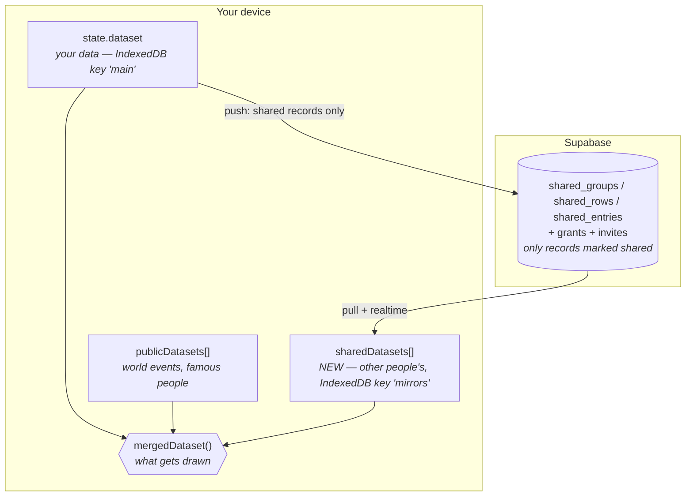

# Sharing — design doc

Status: **Phase 0 signed off (§4). Phase 1 built — see §5 for what landed and
what is still outstanding.** Phases 1b, 2, 3 and 4 not started.

This is the design for the feature the root `CLAUDE.md` has been deferring under
"No publish/subscribe sharing… No Gist sync — it's a marked, honest gap." It is
not a bug fix. It is the first time personal data leaves the device, and the
first backend in the project's history.

---

## 0. The one-paragraph version

A signed-out Chronicle behaves **byte-for-byte as it does today**: IndexedDB,
no network, no account, no SDK loaded. Signing in is opt-in and additive. Once
signed in, the records you have explicitly marked `shared` — and only those —
are mirrored to a Supabase Postgres, where row-level security decides who may
read them. Other people's timelines arrive as **separate read-only datasets
merged into the view**, exactly the way `public-data/*.json` already does, under
a `shared:<account>:` id namespace. They never enter `state.dataset`, so they
are never in your export, and revoking access is a delete of one object, not a
surgical extraction from your own data.

The single most important consequence: **`state.dataset` keeps meaning "my data"**.
Every existing privacy guarantee is stated in terms of that object, and this
design does not weaken any of them.

---

## 1. What the model looks like after this



Export is still `JSON.stringify(state.dataset)`. It gains your own `shared`
flags and nothing else — no grants, no email addresses, no mirrors.

---

## 2. Phase 0 decisions

### D1 — Backend: **Supabase** *(decided)*

| | Supabase | Firebase | Custom (Workers + D1/DO) |
|---|---|---|---|
| Permission model | Postgres **RLS in SQL** — the grant graph is a join | Bespoke rules DSL; needs permissions denormalised onto every doc | Anything, but you write it |
| Realtime | Postgres changes over WS, built in | Native, excellent | Durable Objects; you build fanout |
| Auth | Magic link / OAuth, built in | Built in | You own it |
| Anonymous read (phase 4 QR) | `anon` role + RLS | Rules allow it | Trivial |
| Static-origin friendly | Publishable anon key; RLS is the gate | Same | Same |
| Lock-in | It's Postgres — self-hostable | High | None |
| Ops burden | Near zero | Near zero | Real: uptime, backups, scaling |

The deciding factor is the permission model. Chronicle's rules are relational
("this row is visible if it is `shared` **and** the viewer holds a grant on it
or on any ancestor group"). That is four lines of SQL in an RLS policy and a
denormalisation nightmare in Firestore. Being Postgres also means the
"single developer's hobby project acquires a backend" risk is bounded — the
data can be `pg_dump`ed and moved.

**Cost to state plainly:** Supabase (the company) can read the data at rest,
unless D3 says otherwise. Magic-link delivery needs SMTP configured (the
built-in sender is rate-limited to a handful per hour and is dev-only), so a
transactional email provider is a real, if free-tier, dependency.

### D2 — What leaves the device: **shared records by default, with an opt-in to sync everything** *(decided)*

Two models were on the table:

**(a) Server holds everything, RLS hides the private parts.** Gets multi-device
sync and backup for free. But the promise degrades from "your data is on your
device" to "your data is on a server, and we filter it correctly" — a promise
that depends on a policy being right rather than on the data not being there.

**(b) Server holds only what you published.** The promise stays checkable:
*only timelines you explicitly publish ever leave your device.* A user can
verify it — the un-published rows have no server row at all.

**Decision: (b) is the default, and (a) is an opt-in setting.** Nobody gets
their private life uploaded by signing in; someone who actively wants
multi-device sync can ask for it, knowing what they are asking for.

That makes the upload gate a function of a mode, not a constant, and the mode is
threaded through from the start:

```ts
type SyncMode = "shared-only" | "everything";   // default "shared-only"
syncSubset(dataset, mode): { groups, rows, entries }
```

Four consequences, all of which the implementation has to honour:

1. **RLS is already correct for both modes.** The read policy is *"I own it, or
   it is `shared` and I hold a grant"*. A private row uploaded under
   `everything` is visible to its owner and to nobody else — the same policy,
   no second code path.
2. **Turning the setting back off is a deletion, not a flag flip.** Every
   private record must be removed from the server, or the setting is a lie.
   `diff.ts` gets this for free: the shared subset shrinks, so the diff emits
   tombstones.
3. **`everything` makes `state.dataset` a merge target.** This is the genuinely
   new machinery — under `shared-only`, your own data flows one way (device →
   server) and only *other people's* data flows back, into mirrors. Under
   `everything`, your own records come back from your other devices and have to
   be LWW-merged into `state.dataset` itself. A bug there corrupts the user's
   own data, not a discardable mirror.
4. **Therefore it ships as its own phase.** Phase 1 implements the gate with
   both modes and tests both, but wires only `shared-only` into the UI. Full
   sync lands as **Phase 1b**, immediately after read-only sharing is proven,
   so the merge-into-own-data path gets its own review rather than riding along
   with the invite flow.

The mode lives on the account server-side (a second device must know to pull
everything) and is mirrored locally. The UI still says, plainly, that
`shared-only` means **signing in is not a backup**.

### D3 — Encryption posture: **server-readable payloads**, structured so E2EE stays possible *(decided)*

The server schema deliberately splits every table into:

- **structural / permission columns** — ids, parent ids, `shared`, owner —
  plaintext, because RLS must evaluate them;
- **a `payload` jsonb column** — labels, titles, descriptions, places, dates —
  which is the only part that carries content.

That split is what keeps end-to-end encryption a later option rather than a
rewrite: `payload` becomes ciphertext, RLS keeps working unchanged, and grants
gain a wrapped-key column. Nothing else moves.

Recommend **not** shipping E2EE in phase 1. It buys real privacy but costs key
management, key rotation on revoke, unrecoverable data on device loss, and a
harder phase-4 viewer. Ship the split now, decide the crypto later, and say in
the UI that published data is stored on Chronicle's server and readable by it.

### D4 — Sync and conflicts: **hybrid logical clock + record-level last-writer-wins + tombstones**. One mechanism for all phases.

Chronicle's data is a set of small independent records with flat scalar fields.
It is not a rich-text document, so Yjs/Automerge would be paying a large
dependency for a problem the data shape does not have. An LWW-Element-Set keyed
by a hybrid logical clock converges, is ~100 lines, and is unit-testable as pure
functions.

- **HLC** (`wallClock, counter, accountId`) rather than raw `Date.now()`, because
  two phones with skewed clocks would otherwise let the wrong edit win and let a
  laggy clock lose every race. The `accountId` is the tiebreaker, so the order is
  total.
- **Record-level, not field-level**, in phase 1: one writer per row is the
  normal case there. Phase 3 (two people editing one entry) upgrades to
  per-field clocks — an additive change to the *wire* payload, not to the app
  schema, so it needs no schema version bump.
- **Tombstones are mandatory.** Without `deleted_at`, a delete that reaches a
  peer before a concurrent edit gets resurrected by that edit. `cascade.ts`
  already computes the exact id set a delete touches, which is precisely the
  tombstone set.

Free-text `description` edited by two people at once is the one case LWW loses
keystrokes on. Phase 3 mitigates with presence ("Jannik is editing this"), not
with a CRDT for one field. Documented limitation, revisited only if it bites.

**The mutation layer does not change.** Push works by diffing the current
shared subset against a `lastPushed` snapshot inside the debounced autosave that
already exists. A few hundred records, shallow-compared, is microseconds — and
it means not one of the ~25 action functions in `actions.ts` needs touching, and
no `updatedAt` field enters the app schema.

### D5 — Auth and invites: magic link for editors, **nothing at all** for viewers

- **Editors** (anyone who owns or co-owns data): Supabase Auth magic link. No
  passwords. OAuth can be added later for one-tap.
- **Invites are links, not emails.** Chronicle sends no mail. An invite is a row
  with an unguessable token; you send `…/Chronicle/#/invite/<token>` however you
  like — WhatsApp, in person, a QR code. This suits the product (scenario 4 is
  already QR-shaped) and removes a mail-provider dependency from the invite path.
  Sign-in itself still needs SMTP; that is the one place mail is unavoidable.
- **Viewers** (phase 4): no account, no session, no cookie. The viewer route is
  a separate entry path that **never imports the auth client** — this is the
  concrete mechanism that stops editor auth leaking into the viewer path, and it
  is what makes "no cookie banner" true rather than aspirational: no cookies are
  set and nothing is tracked.

### D6 — Schema v7

Four additions to the personal dataset. That is all.

```ts
export const SCHEMA_VERSION = 7;

interface Group {
  // …existing
  shared?: boolean;          // absent/false = private
  shareByDefault?: boolean;  // the override: things created under here start shared
}

interface TimelineRow {
  // …existing
  shared?: boolean;          // absent/false = private
}

interface TimelineDataset {
  // …existing
  accountId?: string;        // set on sign-in; opaque uuid, never an email
}
```

**Entries have no `shared` flag** — they inherit their row. Per-entry publishing
multiplies the UI surface enormously and no scenario asks for it. Deliberate cut.

**Grants, owners and invites are server-only.** They are access-control facts
that must be enforced server-side anyway, and putting them in the dataset would
put other people's identities into a file users are encouraged to export and
pass around. The local dataset never learns anyone's email address.

#### The migration, and the trap in it

v4 removed `visibility` / `defaultVisibility`. A v1–v3 export **still carries
those keys**, and `validateImport` currently ignores them.

Two rules, both load-bearing:

1. **The new fields are not called `visibility`.** They are `shared` and
   `shareByDefault`. A dead field can therefore never be mistaken for a live
   one by name.
2. **The v7 migration deletes the dead keys** wherever they appear, so no future
   code can pick them up by accident either.

And the decision that matters most: an old `visibility: "public"` **does not
become `shared: true`.** In a backend-less app that field never meant anything
had left the device. Silently converting it would publish someone's data to a
server on the strength of a three-versions-dead flag. Everything migrates to
private; publishing is always a deliberate act.

Otherwise v7 is a version bump with no data step — `shared` absent means
private, which is the safe default for every existing dataset.

### D7 — Revocation

Three layers, in order of how much they can actually promise:

1. **Server** — deleting the grant makes RLS deny the next read *and* the
   realtime stream. This is the enforcement; everything else is hygiene.
2. **Subscriber's device** — the mirror for that owner is deleted from the
   `mirrors` IndexedDB key and dropped from the view. Because mirrors are a
   separate object from `state.dataset`, this is a delete with no risk of taking
   any of the subscriber's own records with it.
3. **Silence, not tombstones, in the UI.** An un-shared row simply stops being
   there. Telling a subscriber "your dad withdrew a timeline" leaks the
   existence of the thing that was withdrawn.

**What cannot be promised, and must be said at share time:** sharing is not
recallable. Anyone who could read it could have screenshotted or exported it.
The UI says so when you publish, in the same honest register the project uses
for the Gist gap — rather than implying a lock that does not exist.

### D8 — Where mirrored data lives (the load-bearing one)

Other people's data goes in `state.sharedDatasets`, a sibling of
`publicDatasets`, namespaced `shared:<ownerAccountId>:` (owner-scoped because
two owners can both have a local id `group-abc-1`). It is merged for display by
the existing `mergedDataset()`.

This one choice is what delivers, for free:

- exports stay clean — `triggerDownload(state.dataset)` cannot leak a mirror;
- revocation is an object delete;
- the "is this editable?" check the UI already does for `pub:` ids extends
  naturally;
- `parentGroupId` works as the attachment point the `types.ts` comment always
  said it would be — a mirrored group nests under one of your local groups.

Co-owned groups are the exception to read-only: the mirror carries
`role: "owner" | "reader"` per group, and writes to an owned mirror route back
through the sync layer instead of into `state.dataset`.

---

## 3. Server schema and RLS

Built in `supabase/migrations/0001_sharing.sql`.

```sql
accounts       (id uuid pk → auth.users, display_name text, sync_mode text)

shared_records (owner_account uuid, kind text, id text,   -- pk: all three
                parent_id text,       -- group→parentGroupId, row→groupId, entry→rowId
                shared boolean,
                payload jsonb,        -- the ONLY content-bearing column (§D3)
                clock text, updated_by uuid, deleted boolean)

group_owners   (owner_account uuid, group_id text, account_id uuid)
grants         (id uuid pk, owner_account uuid, subject_kind text,
                subject_id text, grantee uuid, created_at timestamptz)
invites        (token text pk, owner_account uuid, subject_kind text,
                subject_id text, role text, expires_at timestamptz,
                redeemed_at timestamptz, redeemed_by uuid)
```

**Deviation from the sketch this doc was signed off with:** one `shared_records`
table rather than three. The wire format is uniform, so three tables meant three
copies of one policy for no gain. That paid off in schema v8, where events
became a fourth `kind` and one `case` branch in each of two functions
(`supabase/migrations/0002_events.sql`) rather than a fourth table with its own
policy set — an event's visibility is its row's, exactly like an entry's.

Read policy in words: *a row is visible if I own its group, or it is `shared`
and I hold a grant on it, on its group, or on that group's parent. A group is
visible if it is the container of a visible row, or is published and granted.
An entry inherits its row.* Writes require ownership or co-ownership.

Group nesting is walked exactly **one level**, not recursively — `addSubGroup`
refuses to nest deeper and only one level is drawn, so a recursive CTE would be
machinery for a tree that cannot exist.

`redeem_invite` is a `SECURITY DEFINER` function because the invitee must not be
able to read the `invites` table — that would let anyone enumerate tokens. It is
deliberately silent about *why* a token failed: "expired" and "never existed"
look identical from outside.

**Verified against a real Postgres.** `npm run verify:sql` applies the migration
to a scratch database and runs `supabase/tests/rls.test.sql` — this scenario,
asserted with RLS on and the identity switched per statement the way PostgREST
switches it per request — and CI runs it on every pull request. The first run
found three bugs in SQL that had until then only been read: an invite-token
default using an encoding Postgres does not have (`base64url`), a `for all`
policy that was silently also a SELECT policy and leaked tombstones to readers,
and — in the same policy — an entry branch keyed on *readability* rather than
co-ownership, which gave every read-only grantee write access to the entries on
a shared timeline. All three are fixed; §5 records what is still untested.

---

## 4. Sign-off — settled 2026-08-03

1. **Backend** — Supabase. ✅ as proposed.
2. **What leaves the device** — shared-only **by default**, with an opt-in to
   sync everything. ↩︎ *Amended from the proposal*, which had no opt-in at all;
   see D2 for the four consequences and why full sync ships as Phase 1b.
3. **Audience granularity** — single audience in phase 1. ✅ as proposed.
   Per-person hold-backs stay out; the extension point is a `grant_exclusions`
   table.
4. **Encryption** — server-readable payloads, with the structural/`payload`
   column split that keeps E2EE a later option rather than a rewrite. ✅ as
   proposed.

---

## 5. Phase 1 build plan

Model → storage → sync → UI, tests alongside, per the per-directory conventions.

**`src/model`**
- `types.ts`: `SCHEMA_VERSION = 7`, the four fields from D6.
- `sharing.ts` (new, pure): `defaultSharedForNewRow(dataset, groupId)`,
  `effectiveShared(dataset, row)`, `syncSubset(dataset, mode)` — the last one is
  the privacy-critical gate and gets the heaviest tests, in **both** D2 modes:
  under `shared-only` nothing private escapes, no entry rides along whose row is
  private, no row survives whose group is gone; under `everything` the subset is
  closed over the same referential rules.

**`src/storage`**
- `exportImport.ts`: v7 migration — bump, strip dead `visibility` /
  `defaultVisibility`, do **not** convert them. Tests: a v3 file with
  `visibility: "public"` imports with every row private.
- `db.ts`: new `mirrors` key, load/save/delete.

**`src/sharing`** (new, with its own `CLAUDE.md`)
- `hlc.ts` — hybrid logical clock, pure, tested.
- `lww.ts` — merge record sets by clock with tombstones, pure, tested
  (convergence, commutativity, delete-beats-concurrent-edit).
- `diff.ts` — `lastPushed` vs current shared subset → upserts + tombstones, pure,
  tested (un-publishing produces a tombstone; deleting produces a tombstone).
- `client.ts` — Supabase wrapper, **lazy-imported** so a signed-out user
  downloads no SDK.
- `sync.ts` — push on the existing debounced save; subscribe and apply.
- `mirror.ts` — mirrors → store, revocation drop.

**`src/state`**
- `store.ts`: `sharedDatasets`, `session`, mirror roles; extend `mergedDataset`.
- `actions.ts`: `signIn` / `signOut`, `setShared`, `setShareByDefault`,
  `createInvite`, `redeemInvite`, `revokeGrant`. `addRow` consults
  `defaultSharedForNewRow`.

**`src/ui`**
- A share control on the group header and the row rail — private by default,
  with the not-recallable note at the moment of publishing.
- A "Shared with me" section, visually distinct and read-only unless co-owned.
- Colours via `--color-*` only; `PillSelector` over dropdowns; no Save buttons.

### What landed

All of the above, plus `supabase/migrations/0001_sharing.sql` and a
`SharingBackend` interface with an in-process `fakeBackend` that re-implements
the SQL visibility rule — so `src/sharing/flow.test.ts` drives the whole family
scenario (publish → invite → propagate → edit → un-publish → revoke) without a
live project. 341 tests, typecheck and build clean.

Two behaviours worth recording because they were discovered while testing, not
designed up front, and both turned out to be the ones you want:

- **Un-publishing the last shared timeline in a group also removes the group.**
  The group was only ever on the server as the container of a published row, so
  once nothing in it is shared its name has no business still being there.
- **A mirror that rebuilds to nothing is dropped, not kept as an empty shell.**
  The rail draws a header per group, so an emptied mirror would otherwise render
  as a phantom section carrying someone's name — at exactly the moment their
  name should leave the screen.

### Then landed on top

- **The SQL runs, and is asserted.** `supabase/tests/` + `scripts/verify-sql.sh`
  + a CI job; three real bugs fixed (above). The shim in `supabase/tests/shim.sql`
  stands in for the parts of a Supabase project a bare Postgres lacks — the
  `auth` schema, `auth.uid()`, the `anon`/`authenticated` roles — so the
  migration runs *unmodified*, which is the only version of this check worth
  having.
- **Setup is a script and a document**, not tribal knowledge:
  `scripts/setup-supabase.sh` (local Docker stack or a linked hosted project,
  writing `.env.local`) and `supabase/README.md` (redirect URLs, SMTP, the
  service_role warning, deploying with sharing on).
- **Sign-in and invites reached mobile.** `SharingPanel.tsx` holds the panel;
  the desktop top bar and the mobile ⋯ menu both render it, so the disclosure
  text about server-readable and non-recallable sharing cannot drift between
  the two.

### Still outstanding for phase 1

1. **Configure SMTP** on a hosted project for magic links; the built-in Supabase
   sender is rate-limited and dev-only. Locally `supabase start` catches the
   mail, so this blocks a deployment, not development.
2. **A manual two-account pass on a hosted project**, and an E2E script driving
   two browser contexts through the cycle. What is unproven now is PostgREST's
   request shape and Supabase's auth, not the policies themselves.
3. **A write-back path for a co-owned mirror.** The server accepts a co-owner's
   writes; the client has no route for them, so a co-owned mirror is read-only
   and the UI says so. This is what makes scenario 1 — "my dad fills in his own
   group" — only half true today.

---

## 6. Later phases (sketch only)

- **Phase 1b — opt-in full sync.** The `everything` mode from D2 wired to a
  setting. The work is not the gate (phase 1 builds that) but the return path:
  LWW-merging your own records back into `state.dataset`, and deleting every
  private record from the server when the setting goes off again.
- **Phase 2 — invite chaining.** An invite records who created it; when a new
  account joins a group you co-own, you get a *suggestion*, never a grant. The
  suggestion carries a display name, not an email.
- **Phase 3 — live co-editing.** Same channel, plus presence and per-field
  clocks. No new infrastructure — that is the point of D4.
- **Phase 4 — public profile via QR.** A separate "make public" act, distinct
  from sharing with a person. A capability URL with an unguessable token, read
  by the `anon` role, on a route that never loads the auth client. One-tap
  reciprocal share when the viewer already has a profile.

## 7. Out of scope

Global discovery, search, matching, or recommendation — scenario 6. Nothing here
is designed toward it. A public directory of people has consent, safety and
abuse problems that are a product in their own right, not a follow-up commit.

Also not in phase 1: per-entry publishing, the `everything` sync mode's return
path (Phase 1b), E2EE, and per-person hold-backs.
